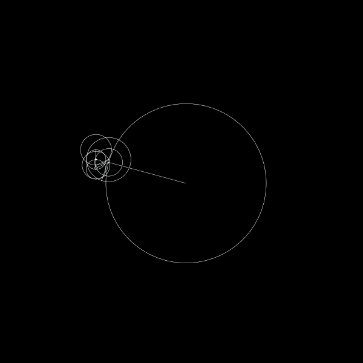

# fourierpainter-python
Visualise complex Fourier transform as sum of plane waves. 

# Usage

Install requirements via 

```
pip install -r requirements.txt
```

Create animation with default settings vis
```
python create_animation.py
```



